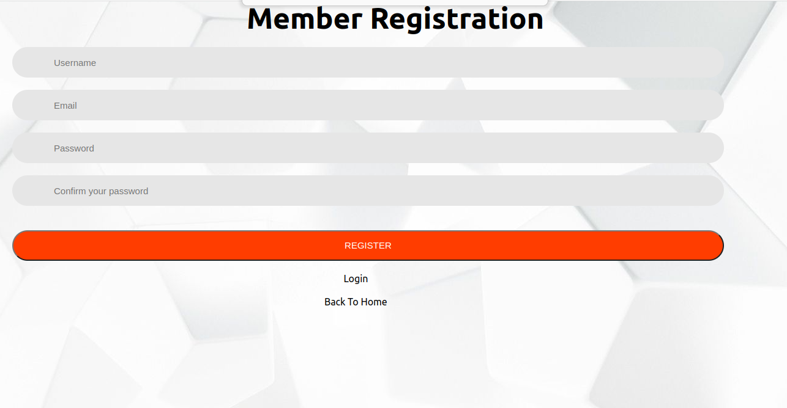

# Find-Your-House

## Project Description
Find-Your-House App is an application designed to track results using back-end API, which was also custom built for this app ([API Repo](https://github.com/verissimohenry/verissimohenry-Find-Your-House-backend.git)). It fetches data. It also allows users to post new data.

### Features
- Login with username
- Responsive design that works for Mobile, Tablet and Desktop
- Helps Find houses data
- Post new Description data

### Built with
- Node.js
- React
- React-DOM
- React-Create-App
- Redux
- npm
- CSS
- ES6
- Ruby on Rails for Backend API ([API Repo](https://github.com/verissimohenry/verissimohenry-Find-Your-House-backend.git))

## Project Screenshot 

## House page

## House-Detail Page

## Favourite Page

## Registration and login Page

## Live Demo
[Click link](https://super-pothos-7cd5fe.netlify.app/)

## Getting Started Locally

- Clone the repo `https://github.com/verissimohenry/-Find-Your-House-frontend-.git`
- cd into the project
- Run `npm install` to install dependencies
- In the terminal run `npm start` open up the live server
- Point your browser to http://localhost:3000/ to load the app

### Testing
- To run tests write `npm test` in the terminal

## AUTHOR

👤 **Verissimo Henry**

- Github: [@githubhandle](https://github.com/verissimohenry)
- Twitter: [@twitterhandle](https://twitter.com/verissimohenry)
- Linkedin: [linkedin](https://www.linkedin.com/in/henry-verissimo-618906167/)
- Email: verissimohenry04@gmail.com

## Contributing

Contributions, issues and feature requests are welcome!

## Show your support

Give a ⭐️ if you like this project!

## License

MIT License
